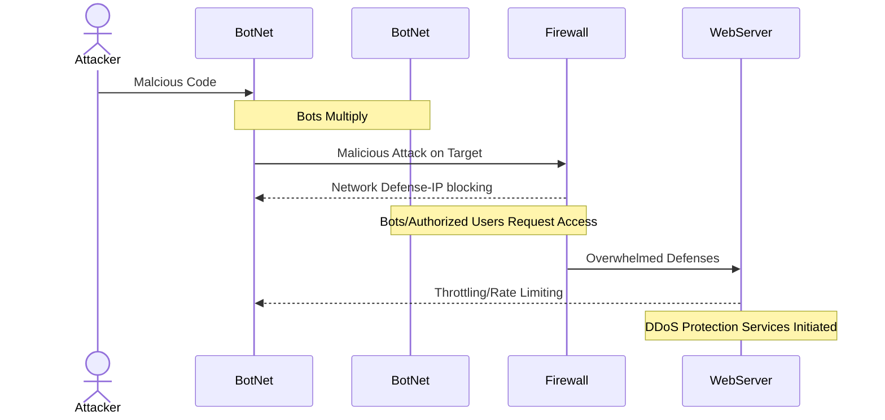

## DDoS_Attack_Sequence

### The Attack
* Sends malware to the initial device
* The malware is multiplied across several devices forming a *botnet*
* The BotNet attacks the Web Server with abnormal amount of requests

### The Defense
* Initially, the firewall takes the brunt of the attack by blocking malicious IP addresses
  * In this instance, the firewall is overwhelmed by the requests from legitimate and malicious IP addresses
* Throttling, or *rate limiting*, limits the network traffic during the influx of requests, this prevents web servers from the overwhelm from specific IP addresses 
* DDos Protection Services activated, in conjunction with throttling, to assist in keeping servers online and maintaining legitimate traffic requests along with shutting down the attack
* The web servers remain online while the security team addresses the attack
    
  
  
